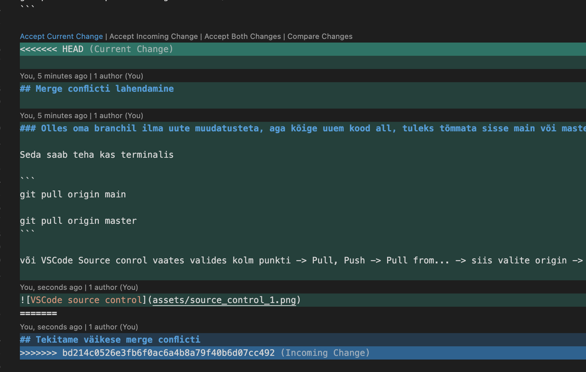
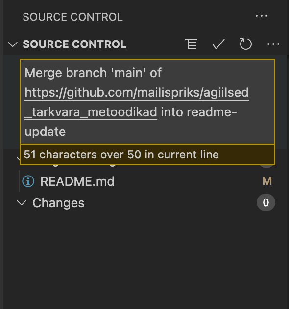
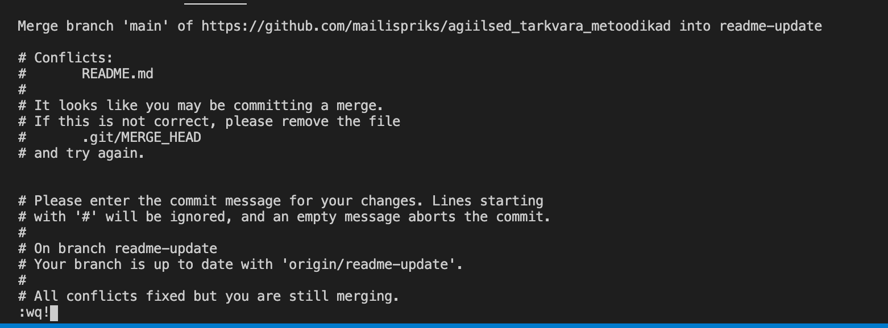

# Agiilsed tarkvara metoodikad

## Feature branchid
### Uue branchi loomine. Tavaliselt kasutatakse branchi nimena:

- Esimene osa on tüüp (story - feature, bug - bugfix)
- Teine osa pileti number
```
git checkout -b feature/ABC-123
```

### Olemasolevale branchile minemine

```
git checkout feature/ABC-123
```

### Uute muudatuste endale alla tõmbamine

```
git pull
```

### Staatuse vaatamine

```
git status
```

### Failide lisamine enne commiti. Punktiga lisab kõik failid, milles muudatus tehtud

```
git add filename

git add .
```

### Commitimine - muudatuste "salvestamine" koos sõnumiga, mis muudatusi tehti. Lühendiga "-am" tehakse ka automaatselt "git add ." erinevusega, et uusi faile ei lisata commiti, ainult need, milles muudatus tehti.

```
git commit -m 'This is commit message'

git commit -am 'This is commit message'

git commit -am 'This is commit message' && git push
```

### Muudatuste lükkamine giti. Kui branch on juba olemas gitis, siis esimene variant, kui veel ei ole olemas siis teine variant.

```
git push

git push --set-upstream origin feature/ABC-123
```


## Merge conflicti lahendamine

### Olles oma branchil ilma uute muudatusteta, aga kõige uuem kood all, tuleks tõmmata sisse main või master (olenevalt nimetusest) branch.

Seda saab teha kas terminalis

```
git pull origin main

git pull origin master
```

või VSCode Source conrol vaates valides kolm punkti -> Pull, Push -> Pull from... -> siis valite origin -> origin/main


## Kui nüüd fail VSCodes avada, näeme, et 2 eri koodi ei "sobi" kokku.
Meie peame valima, kas võtame:
- sissetulevad muudatused (Accept current change)
- enda muudatused (Accept incomig change)
- mõlemad (Accept both changes)



Fail tuleb üle salvestada ja teha uuesti `git add .` või source controli alt lisada.

Nüüd on variat kasutada VSCode source controli all tekkinud commit messaget ja vajutada linnukest (ja teha ka git push!)



Või commitida käsitsi (ei soovita, aga kui vaja ise message kirjutada).
Või jätkata mergemist terminalis käsuga

```
git merge --continue
```

Siis ta näitab ära kõik message:



Terminal ise läheb automaatselt vim editori seal tuleb teha write and quit:

```
:wq!
```

ja vajutada enter. Siis teha git push ja merge conflict ongi lahendatud!
